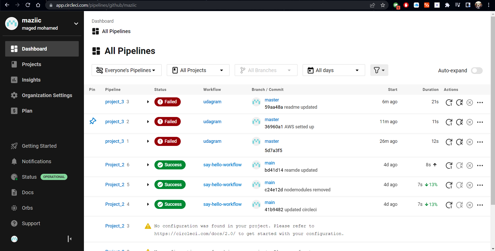
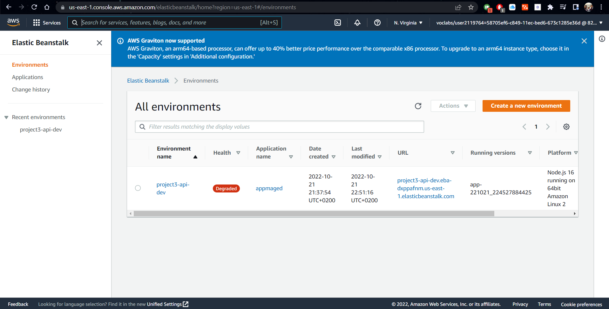
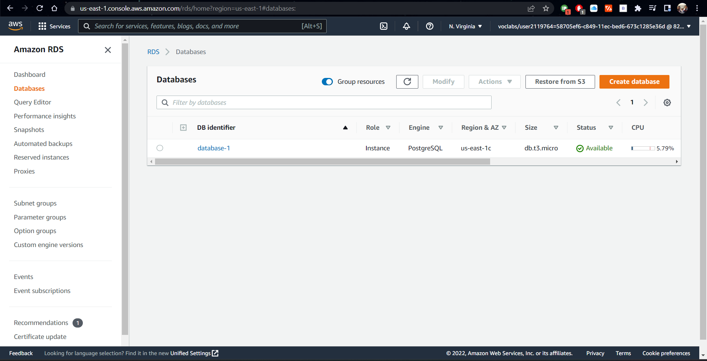
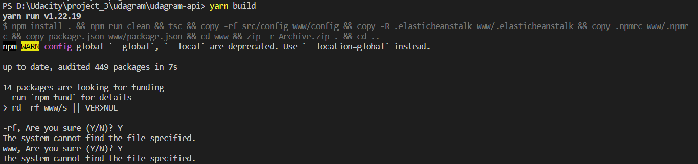

# project_3

You can find attached screenshots of Circle ci dashboard , AWS services [eb,rds,s3]

the circle ci I tested with a sample configuration file with in the repo https://github.com/maziic/Project_2.git
of the old project if you would like to check the work on it but I have the of the missing file that I state below

I have almost completed the tasks but I ran into a problem with the code and its compaitbility with windows which I have been trying
to solve but reaching dead end

As shown in the image the problem is within the package.json of the backend it had a lot of issues that I solved but still it does not work my understanding of the problem is that in the commands it is trying to reach the build folder but in the command of the build `"build": "npm install . && npm run clean && tsc && copy -rf src/config www/config && copy -R .elasticbeanstalk www/.elasticbeanstalk && copy .npmrc www/.npmrc && copy package.json www/package.json && cd www && zip -r Archive.zip . && cd .."`

it is not working properly and cannot see the www build folder and also had problem with 'copy' which I think might have an effect but again did not find anything helpful or some other way of doing this.
